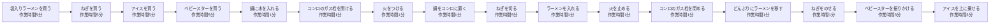

```mermaid
flowchart  LR;
d2[袋入りラーメンを買う
作業時間5分]
d3[ねぎを買う
作業時間5分]
d4[アイスを買う
作業時間5分]
d5[ベビースターを買う
作業時間5分]
d6[鍋に水を入れる
作業時間1分]
d7[コンロのガス栓を開ける
作業時間1分]
d8[火をつける
作業時間1分]
d9[鍋をコンロに置く
作業時間1分]
d10[ねぎを切る
作業時間5分]
d11[ラーメンを入れる
作業時間1分]
d12[火を止める
作業時間1分]
d13[コンロのガス栓を閉める
作業時間1分]
d14[どんぶりにラーメンを移す
作業時間1分]
d15[ねぎをのせる
作業時間1分]
d16[ベビースターを振りかける
作業時間3分]
d17[アイスを上に乗せる
作業時間3分]

d2 --> d3
d3 --> d4
d4 --> d5
d5 --> d6
d6 --> d7
d7 --> d8
d8 --> d9
d9 --> d10
d10 --> d11
d11 --> d12
d12 --> d13
d13 --> d14 
d14 --> d15
d15 --> d16
d16 --> d17
```