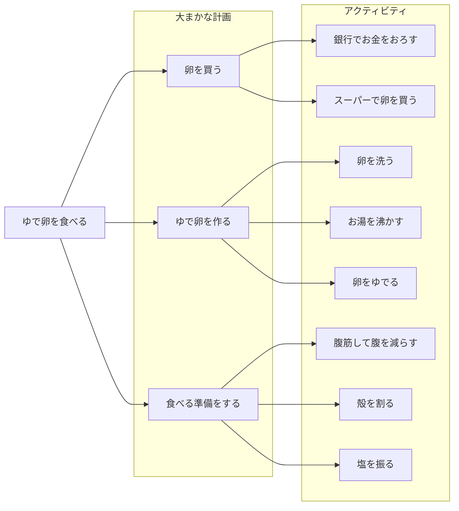

```mermaid
flowchart LR;
  d1["ゆで卵を食べる"]
  subgraph 大まかな計画
  d2[卵を買う]
  d3[ゆで卵を作る]
  d4[食べる準備をする]
  end
  subgraph アクティビティ
  d5[銀行でお金をおろす]
  d6[スーパーで卵を買う]
  d7[卵を洗う]
  d8[お湯を沸かす]
  d9[卵をゆでる]
  d10[腹筋して腹を減らす]
  d11[殻を割る]
  d12[塩を振る]
  end
  d1 --> d3
  d1 --> d2
  d1 --> d4
  d2 --> d5
  d2 --> d6
  d3 --> d7
  d3 --> d8
  d3 --> d9
  d4 -->d10
  d4 -->d11
  d4 -->d12
```