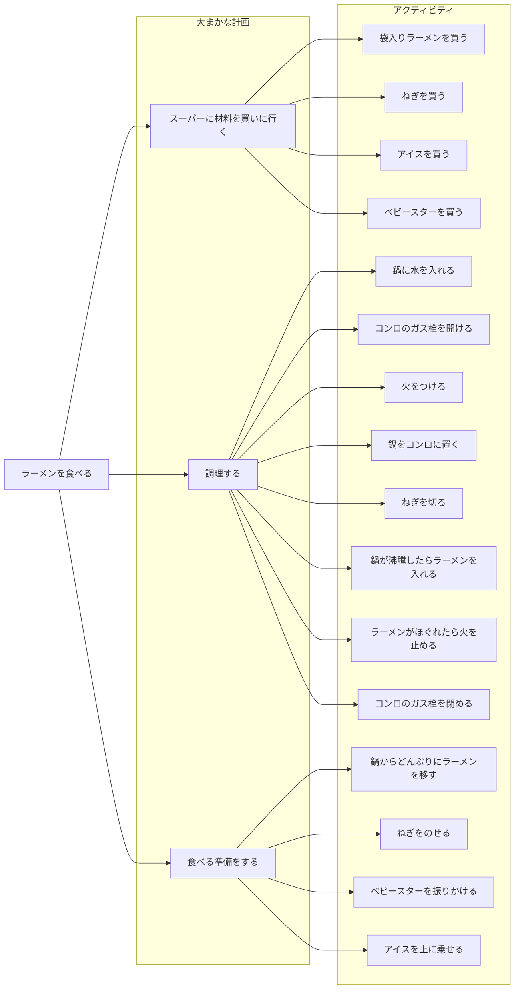

```mermaid
flowchart  LR;
d1[ラーメンを食べる]
subgraph 大まかな計画
d02[スーパーに材料を買いに行く]
d03[調理する]
d04[食べる準備をする]
end
subgraph アクティビティ
d2[袋入りラーメンを買う]
d3[ねぎを買う]
d4[アイスを買う]
d5[ベビースターを買う]
d6[鍋に水を入れる]
d7[コンロのガス栓を開ける]
d8[火をつける]
d9[鍋をコンロに置く]
d10[ねぎを切る]
d11[鍋が沸騰したらラーメンを入れる]
d12[ラーメンがほぐれたら火を止める]
d13[コンロのガス栓を閉める]
d14[鍋からどんぶりにラーメンを移す]
d15[ねぎをのせる]
d16[ベビースターを振りかける]
d17[アイスを上に乗せる]
end
d1 --> d02
d1 --> d03
d1 --> d04
d02 --> d2
d02 --> d3
d02 --> d4
d02 --> d5
d03 --> d6
d03 --> d7
d03 --> d8
d03 --> d9
d03 --> d10
d03 --> d11
d03 --> d12
d03 --> d13
d04 --> d14
d04 --> d15
d04 --> d16
d04 --> d17
```