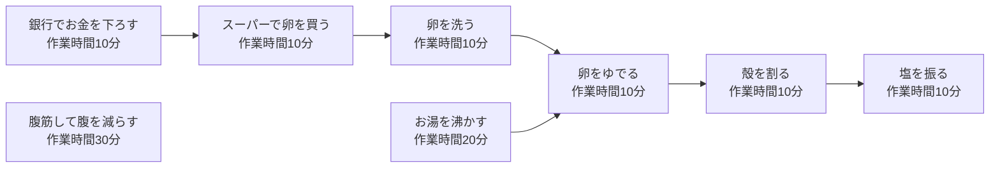

```mermaid
flowchart LR;
d1["銀行でお金を下ろす
作業時間10分"]
d2["スーパーで卵を買う
作業時間10分"]
d3["卵を洗う"
作業時間10分]
d4["お湯を沸かす"
作業時間20分]
d5["卵をゆでる"
作業時間10分]
d6["殻を割る"
作業時間10分]
d7["塩を振る"
作業時間10分]
d8["腹筋して腹を減らす"
作業時間30分]

d1 --> d2
d2 --> d3
d3 --> d5
d4 --> d5
d5 --> d6
d6 --> d7
```